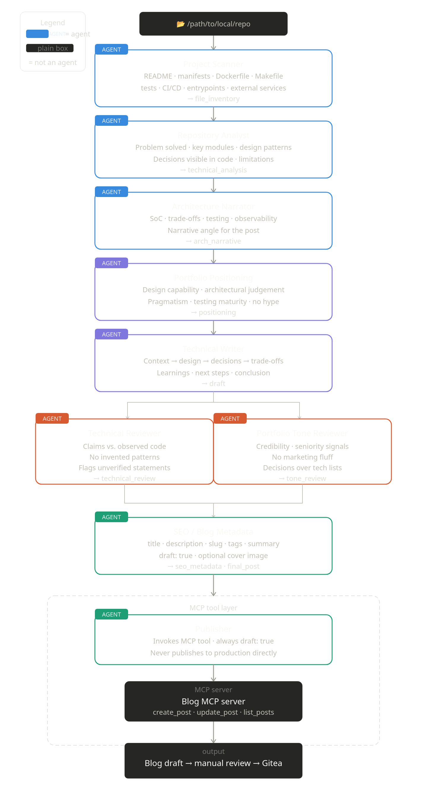

# PostCraft

PostCraft is a local editorial pipeline for turning software repositories into
credible technical portfolio posts.



The project solves a common gap in engineering portfolios: real projects often
contain useful design decisions, trade-offs, tests, automation, and learning, but
that evidence usually stays buried in the repository. PostCraft is meant to
read a local codebase, understand what it actually contains, and transform that
evidence into a technical article that explains the problem, the design, the
engineering judgement, and the professional value of the work.

The system is designed around evidence before narrative. It first scans the
repository, identifies the stack, entrypoints, documentation, tests,
configuration, automation, and relevant source files, and selects a small set of
files that can support a grounded analysis. From there, a multi-agent workflow
builds a factual inventory, interprets the architecture and main flows, proposes
portfolio-oriented angles, extracts professional signals, drafts the post,
reviews technical claims, improves the tone, prepares metadata, and finally
creates a blog draft.

The goal is not to generate generic marketing copy or inflate a project beyond
what the code supports. The goal is to produce articles that show engineering
judgement: why a project exists, what constraints shaped it, which technical
decisions mattered, what trade-offs were accepted, how maintainability and
testing were approached, what was learned, and what could reasonably come next.

PostCraft should keep the process auditable. Each run should produce a local
workspace with the files and intermediate artifacts used to create the post:
inventory, selected evidence, project facts, technical analysis, candidate
angles, portfolio positioning, outline, draft, technical review, final article,
metadata, warnings, and publication result. This makes it possible to review how
the post was generated and to correct unsupported claims before anything reaches
the blog.

Publishing is part of the complete workflow, but it must remain controlled. The
system should create drafts through the blog MCP and mark them as drafts by
default. Final publication stays a manual editorial decision, with the generated
post traceable back to repository evidence and review artifacts.

## Project Evolution

This section documents what has already been implemented in PostCraft and will
be updated as the pipeline grows.

Ongoing progress notes are tracked in [progress/20260514.md](progress/20260514.md).
This is where we will keep updating the concrete evolution of the project,
including what changed, what the latest runs revealed, and what needs to be
fixed next.

### Implemented Flow

PostCraft currently supports a local, auditable draft-generation flow. The user
passes a repository path to the CLI, and the system creates a workspace with the
intermediate evidence and writing artifacts produced during the run.

The implemented flow is:

```text
local repository
  -> project scanner
  -> repository analyst
  -> architecture narrator
  -> portfolio positioning
  -> outline generator
  -> technical writer
  -> technical reviewer
  -> final editor or blocked finalization
  -> local workspace
```

The main command is:

```bash
make draft PATH=/path/to/repository
```

Internally, this calls:

```bash
uv run python -m src.adapters.primary.cli draft-project-post /path/to/repository
```

There is also an analysis-oriented command:

```bash
make analyze PATH=/path/to/repository
```

### Implemented Agents

#### Project Scanner Agent

The `ProjectScannerAgent` is the factual entry point of the pipeline. It scans a
local project directory and builds the base evidence used by the rest of the
system.

It currently detects:

- files and directories in the repository;
- language counts by file extension;
- known project manifests such as `pyproject.toml`, `Cargo.toml`, and similar
  configuration files;
- probable technologies;
- relevant project signals such as entrypoints, documentation, tests,
  automation, and architecture-related folder names;
- a bounded list of selected files that are likely to help explain the project.

The scanner is intentionally evidence-first. Its job is not to write narrative,
but to decide what the system knows about the repository and which files deserve
attention in later stages.

#### Repository Analyst Agent

The `RepositoryAnalystAgent` takes the scanner output and asks the LLM for a
technical interpretation of the repository.

It uses the selected evidence files and observed project signals to produce:

- an architecture-oriented analysis;
- observed or tentative patterns;
- a technical summary;
- strengths and limitations;
- doubts where the available evidence is incomplete.

This agent is where the system starts moving from raw inventory to technical
understanding, but it is still expected to separate observed facts from
reasonable inferences.

#### Architecture Narrator Agent

The `ArchitectureNarratorAgent` turns the technical analysis into possible
article angles.

It proposes several portfolio-oriented narratives, each with:

- a thesis;
- evidence;
- portfolio value;
- risks;
- a recommended angle;
- claims that should be avoided.

Its purpose is to prevent the post from becoming a simple technology inventory.
Instead of saying only what stack the project uses, this step tries to identify
what story the project can credibly tell.

#### Portfolio Positioning Agent

The `PortfolioPositioningAgent` translates technical evidence into professional
signals.

It identifies:

- strong signals that are well supported by the repository;
- moderate signals that can be used carefully;
- claims that should not be made;
- phrases that fit the post;
- phrases that should be avoided because they sound inflated or unsupported.

This agent is responsible for keeping the article useful as portfolio material
without turning it into CV-style self-promotion.

#### Outline Agent

The `OutlineAgent` creates the structure of the article before the first draft
is written.

It organizes the post around a story such as:

```text
problem -> project goal -> design -> decisions -> trade-offs -> learning
```

The outline includes the intended purpose of each section and the evidence that
should be used there. This gives the writer a plan and makes the article less
likely to collapse into a list of dependencies.

#### Technical Writer Agent

The `TechnicalWriterAgent` writes the first Markdown draft from the outline,
technical analysis, and portfolio positioning.

Its role is to produce a readable technical article using only supported claims.
It is instructed to avoid unsupported production claims, avoid overstating the
architecture, and mark uncertain claims as pending verification when needed.

#### Technical Reviewer Agent

The `TechnicalReviewerAgent` reviews the draft against the project facts and
technical analysis.

It classifies the content into:

- supported claims;
- weak or unsupported claims;
- exaggerations;
- required corrections;
- optional improvements;
- final verdict.

The reviewer can return `PASS` or `BLOCK`. If it returns `BLOCK`, the pipeline
does not pretend that the draft is final.

#### Final Editor Agent

The `FinalEditorAgent` is used only when the technical review allows
finalization.

It applies the review feedback, softens unsupported wording, removes weak
claims, and produces the final local Markdown post.

If the review blocks finalization, PostCraft writes a blocked `final.md`
artifact explaining that the draft needs correction before it can be treated as
final.

### Workspace Artifacts

Each draft run creates a timestamped workspace under `workspaces/`.

The currently generated artifacts are:

```text
input.json
file_inventory.md
selected_files.md
project_facts.md
technical_analysis.md
post_angles.md
portfolio_positioning.md
outline.md
draft.md
technical_review.md
final.md
warnings.md
```

The workspace is meant to make the generation process inspectable. A user can
open the inventory, see which files were selected as evidence, inspect the
analysis, review the chosen angle, read the draft, and understand why the final
post was produced or blocked.

### Metrics

Each run also writes a metrics snapshot to:

```text
logs/last_run_metrics.json
```

The metrics include:

- command name;
- project path;
- request options such as audience, language, and target length;
- selected file count and selected paths;
- selected excerpt size;
- artifact character counts;
- pipeline timings;
- warning count;
- whether the technical review blocked finalization.

These metrics are useful for understanding how a generation behaved and for
debugging why a specific run produced a weak or blocked draft.

### Current Boundary

The implemented system is still local-first. It can analyze repositories and
generate auditable draft workspaces, but it does not yet publish posts to the
blog.

The intended publishing behavior remains: when publication support is added,
PostCraft should create blog entries as drafts through the blog MCP, keep
`draft: true`, and leave final publication as a manual editorial decision.
